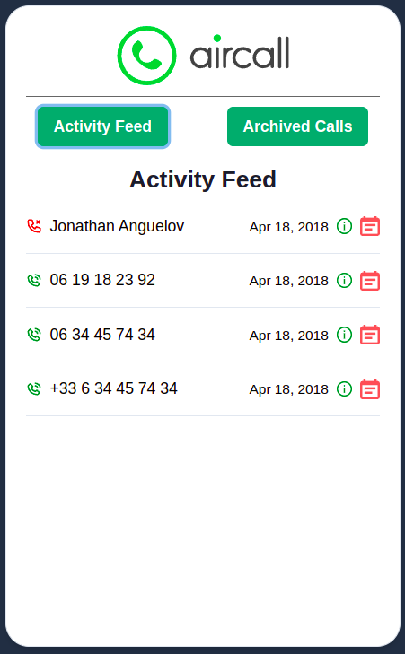
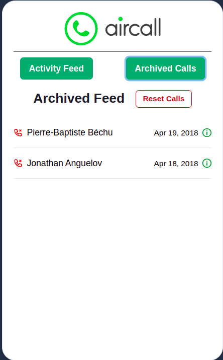

# AirCall App
An app that lets users view, archive and unarchive all the calls requested using an API

 
## Summary

The app will have two different components:
- **Activity Feed** - simple list of calls
- **Activity Detail** - detail of a call
- **Archive** - the final user can archive (and unarchive) a call. Archived calls will no longer be displayed on the Activity Feed and are displayed in a separate Archived Tab.

## Installation

```
npm install
npm start
```

## API documentation

### Routes

Here is the API address: https://aircall-job.herokuapp.com.

- **GET** - https://aircall-job.herokuapp.com/activities: get calls to display in the Activity Feed
- **GET** - https://aircall-job.herokuapp.com/activities/:id: retrieve a specific call details
- **POST** - https://aircall-job.herokuapp.com/activities/:id: update a call. The only field updatable is `is_archived (bool)`. You'll need to send a JSON in the request body:
```
{
  is_archived: true
}
```
- **GET** - https://aircall-job.herokuapp.com/reset: Reset all calls to initial state (usefull if you archived all calls).

### Call object

- **id** - unique ID of call
- **created_at** - creation date
- **direction** - `inbound` or `outbound` call
- **from** - caller's number
- **to** - callee's number
- **via** - Aircall number used for the call
- **duration** - duration of a call (in seconds)
- **is_archived** - call is archived or not
- **call_type** - can be a `missed`, `answered` or `voicemail` call.